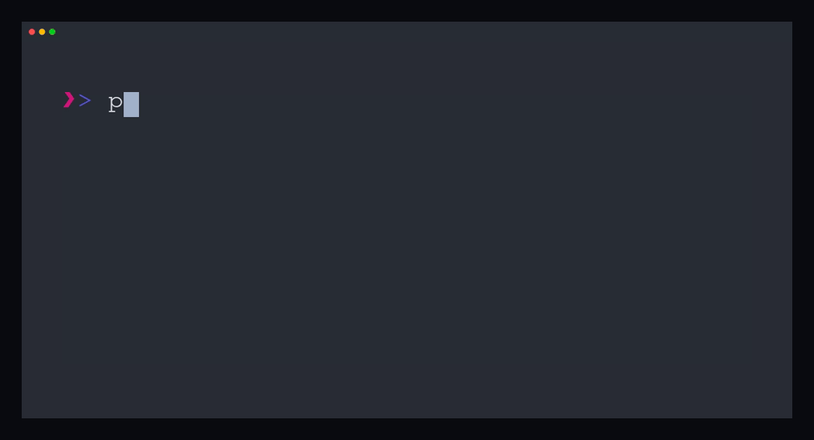

# tmux Session Manager

[日本語版READMEはこちら](README_jp.md)

tmux Session Manager is a popup-based UI that lets you browse and manage tmux sessions, windows, and panes with a workflow similar to lazygit. It offers visual navigation, live previews, and fast switching powered by fzf.



## Features

- 📝 **Visual session list**: Icons and colors make states immediately recognizable.
- 🔍 **Live preview**: Inspect session content without leaving the popup.
- ⚡ **Fast switching**: Smooth interaction thanks to fzf.
- 🎨 **Themeable**: Ships with Tokyo Night, Catppuccin, and the default tmux palette.
- 📊 **Hierarchical navigation**: Drill into sessions → windows → panes with consistent key bindings.

## Requirements

- tmux 3.2 or later (popup feature required)
- fzf 0.30.0 or later
- bash 4.0 or later

## Installation

### With TPM (Tmux Plugin Manager)

Add the plugin to `.tmux.conf`:

```tmux
set -g @plugin 'takeshiD/tmux-session-manager'
```

Press `prefix + I` inside tmux to install.

### Manual installation

```bash
git clone https://github.com/takeshiD/tmux-session-manager.git \
    ~/.tmux/plugins/tmux-session-manager
```

Then add:

```tmux
run-shell ~/.tmux/plugins/tmux-session-manager/tmux-session-manager.tmux
```

Reload your config:

```bash
tmux source-file ~/.tmux.conf
```

## Usage

### Basic key bindings

`prefix + Space` launches the session switcher by default.  
Override the key with `set -g @session-manager-key 'C-s'` (triggered as `prefix + C-s`).

**Session list mode**
- `Enter`: Switch to the selected session
- `Space`: Drill down into windows
- `Ctrl-n`: Create a new session
- `Ctrl-r`: Rename a session
- `Ctrl-x`: Delete a session
- `Ctrl-/`: Toggle preview
- `q`: Quit

**Window detail mode**
- `Enter`: Switch to the selected window
- `Space`: Drill down into panes
- `ESC`: Return to the session list
- `Ctrl-/`: Toggle preview
- `q`: Quit

**Pane detail mode**
- `Enter`: Switch to the selected pane
- `ESC`: Return to the window view
- `Ctrl-/`: Toggle preview
- `q`: Quit

## Configuration

All options are set in `.tmux.conf`:

```tmux
# Change the key binding(default 'SPACE')
set -g @session-manager-key 'SPACE'

# Switch theme (tokyonight | catppuccin | default)
set -g @session-manager-theme 'catppuccin'

# Popup size
set -g @session-manager-popup-width '80%'
set -g @session-manager-popup-height '70%'

# Disable the tmux popup border (equivalent to display-popup -B)
set -g @session-manager-popup-border 'off'

# fzf border style (none | rounded | sharp | any value accepted by `fzf --border`)
set -g @session-manager-fzf-border 'none'

# Preview width
set -g @session-manager-preview-width '65'

# Debug logging
set -g @session-manager-debug '1'
```

`@session-manager-popup-border` hides the popup frame when set to `off`, `false`, `0`, or `none`.  
`@session-manager-fzf-border` forwards its value to `fzf --border`, so you can choose `rounded` (default), `sharp`, `none`, and more.

## Themes

- `tokyonight` (default)
- `catppuccin`
- `default` (tmux stock colors)

## Icon legend

- 📝 Green: current session
- 📎 Yellow: attached session
- 💤 Gray: detached session

## Activity markers

- 🔥 Active within the last 5 minutes
- ⚡ Active within the last hour

## Troubleshooting

### Popup does not appear

Verify your tmux version:

```bash
tmux -V  # must be >= 3.2
```

### fzf is missing

Install fzf:

```bash
# macOS
brew install fzf

# Ubuntu
sudo apt install fzf
```

## License

MIT License
